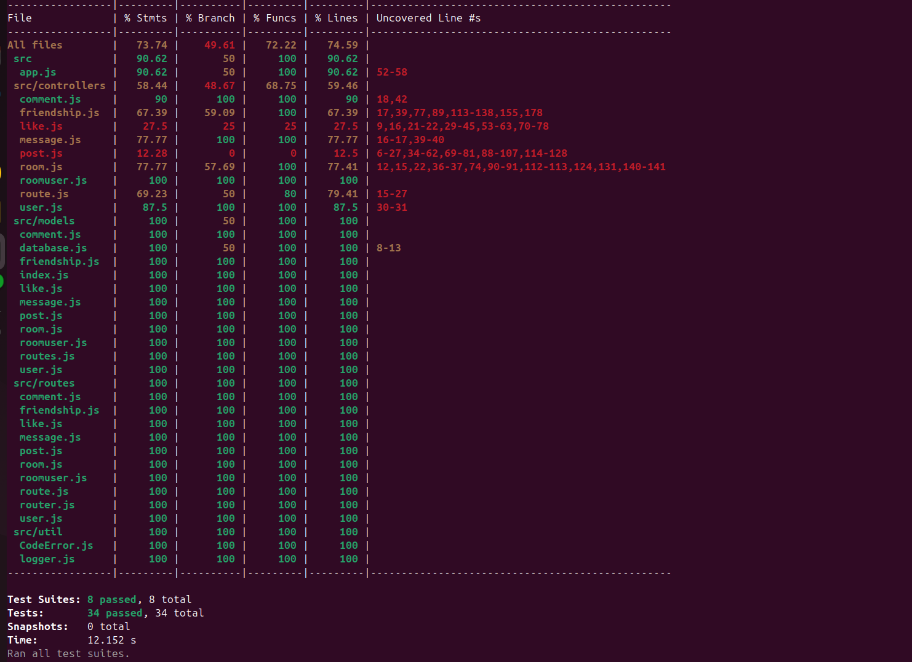
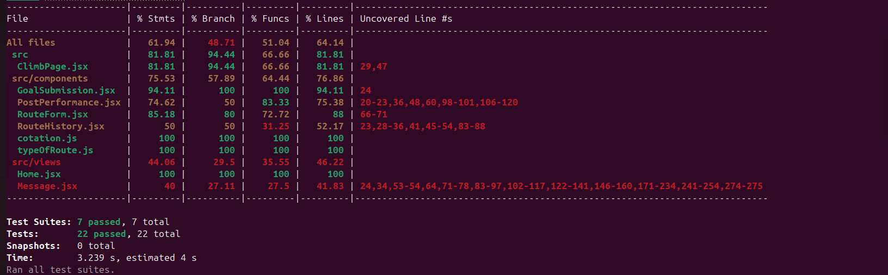

| **Méthode HTTP** | **URL**                                      | **Description**                                             | **Corps attendu (body)**                                            | **Headers**                                       | **Remarque**                                                    |
| ---------------- | -------------------------------------------- | ----------------------------------------------------------- | ------------------------------------------------------------------- | ------------------------------------------------- | --------------------------------------------------------------- |
| **POST**         | `/realms/main/protocol/openid-connect/token` | Obtenir un token d'accès Keycloak (client credentials flow) | `grant_type=client_credentials&client_id=backend&client_secret=xxx` | `Content-Type: application/x-www-form-urlencoded` | Sert à récupérer le token pour authentifier les appels admin    |
| **GET**          | `/admin/realms/main/users`                   | Récupérer la liste des utilisateurs Keycloak                | —                                                                   | `Authorization: Bearer <access_token>`            | Utilisé pour synchroniser les utilisateurs locaux avec Keycloak |

---

## Architecture du code

### FrontEnd

Indiquer ici l'organisation de votre code. Et les choix faits pour le frontend.

~~~bash

login@pc climbing_app % tree --charset=ascii frontend
## Arborescence du frontend

L'arborescence suivante présente l'organisation des fichiers côté frontend :

```bash
frontend
.
|-- package.json            # Dépendances du projet frontend (React)
|-- package-lock.json       # Verrouillage des versions npm
|-- yarn.lock               # Verrouillage pour yarn (si utilisé)
|-- public                  # Fichiers publics statiques
|   |-- favicon.ico
|   |-- index.html
|   |-- logo192.png
|   |-- logo512.png
|   |-- manifest.json
|   `-- robots.txt
|-- src                     # Code source de l'application React
|   |-- index.jsx           # Point d'entrée de l'application React
|   |-- App.jsx             # Composant principal de l'application
|   |-- App.css
|   |-- App.test.jsx        # Tests unitaires sur App
|   |-- index.css
|   |-- keycloak.js         # Configuration de Keycloak côté frontend
|   |-- reportWebVitals.js
|   |-- setupTests.js       # Configuration des tests
|   |-- ClimbPage.jsx
|   |-- ClimbPage.css
|   |-- components          # Ensemble des composants réutilisables
|   |   |-- cotation.js
|   |   |-- typeOfRoute.js
|   |   |-- GoalSubmission.jsx
|   |   |-- GoalSubmission.css
|   |   |-- GoalTracker.jsx
|   |   |-- GoalTracker.css
|   |   |-- Layout.jsx
|   |   |-- Navbar.jsx
|   |   |-- Navbar.css
|   |   |-- PostPerformance.jsx
|   |   |-- PostPerformance.css
|   |   |-- RouteChart.jsx
|   |   |-- RouteChart.css
|   |   |-- RouteForm.jsx
|   |   |-- RouteForm.css
|   |   |-- RouteHistory.jsx
|   |   |-- RouteHistory.css
|   |-- views               # Les différentes vues/pages principales de l'application
|   |   |-- Home.jsx
|   |   |-- Home.css
|   |   |-- Message.jsx
|   |   |-- Message.css
|   |   |-- Search.jsx
|   |   |-- Search.css

~~~

### Backend

#### Schéma de votre base de donnée


```mermaid
erDiagram
  USER {
    integer id
    string email
    string username
    string first_name
    string last_name
  }
  POST {
    integer id
    integer user_id
    integer route_id
    string content
  }
  COMMENT {
    integer id
    integer user_id
    integer post_id
    string content
  }
  FRIENDSHIP {
    integer id
    integer follower_id
    integer followed_id
    string status
  }
  LIKE {
    integer id
    integer user_id
    integer post_id
  }
  ROUTE {
    integer id
    integer userId
    date date
    string route
    string typeOfRoute
    string cotation
    string feeling
  }
  ROOM {
    integer id
    string name
    string type
  }
  ROOMUSER {
    integer roomId
    integer userId
    string role
  }
  MESSAGE {
    integer id
    string content
    integer userId
    integer roomId
  }

  USER ||--o{ POST : "hasMany"
  POST ||--o{ COMMENT : "hasMany"
  POST ||--o{ LIKE : "hasMany"
  COMMENT }o--|| POST : "belongsTo"
  LIKE }o--|| POST : "belongsTo"
  ROOM ||--o{ ROOMUSER : "hasMany"
  ROOM ||--o{ MESSAGE : "hasMany"
  ROOMUSER }o--|| ROOM : "belongsTo"
  ROOMUSER }o--|| USER : "belongsTo"
  MESSAGE }o--|| USER : "belongsTo"
  MESSAGE }o--|| ROOM : "belongsTo"
  USER ||--o{ COMMENT : "hasMany"
  USER ||--o{ LIKE : "hasMany"
  USER ||--o{ MESSAGE : "hasMany"
  USER ||--o{ ROUTE : "hasMany"
  ROUTE ||--|| POST : "hasOne"
  POST }o--|| ROUTE : "belongsTo"
  FRIENDSHIP }o--|| USER : "follower_id"
  FRIENDSHIP }o--|| USER : "followed_id"

```

#### Architecture de votre code

Indiquer ici l'organisation de votre code. Et les choix faits pour le backend.

~~~bash
# exemple d'arborescence commentée
tree --charset=ascii backend
.
|-- package.json            # Dépendances du projet backend (Node.js)
|-- package-lock.json       # Verrouillage des versions npm
|-- Procfile                # Fichier de déploiement (Heroku/Procfile)
|-- swagger_output.json     # Fichier généré automatiquement pour la documentation Swagger
|-- src
|   |-- app.js              # Configuration principale de l'application Express
|   |-- server.js           # Lancement du serveur Express
|   |-- controllers         # Logique métier des différentes entités
|   |   |-- comment.js
|   |   |-- friendship.js
|   |   |-- like.js
|   |   |-- message.js
|   |   |-- post.js
|   |   |-- room.js
|   |   |-- roomuser.js
|   |   |-- route.js
|   |   `-- user.js
|   |-- frontend
|   |   `-- index.html      
|   |-- jobs
|   |   `-- syncUser.js     # Job de synchronisation des utilisateurs Keycloak
|   |-- models              # Définition des tables via Sequelize
|   |   |-- comment.js
|   |   |-- database.js
|   |   |-- friendship.js
|   |   |-- index.js
|   |   |-- like.js
|   |   |-- message.js
|   |   |-- post.js
|   |   |-- room.js
|   |   |-- roomuser.js
|   |   |-- routes.js
|   |   `-- user.js
|   |-- routes              # Déclaration des routes API Express
|   |   |-- comment.js
|   |   |-- friendship.js
|   |   |-- like.js
|   |   |-- message.js
|   |   |-- post.js
|   |   |-- room.js
|   |   |-- roomuser.js
|   |   |-- route.js
|   |   |-- router.js
|   |   `-- user.js
|   |-- __tests__           # Dossier contenant les tests unitaires backend
|   |   |-- comment.test.js
|   |   |-- friendship.test.js
|   |   |-- like.test.js
|   |   |-- message.test.js
|   |   |-- room.test.js
|   |   |-- roomuser.test.js
|   |   |-- route.test.js
|   |   `-- user.test.js
|   `-- util                # Fichiers utilitaires
|       |-- CodeError.js
|       |-- logger.js
|       |-- swagger.js
|       `-- updatedb.js
~~~
### Gestion des rôles et droits

---

## Côté **Backend**

### Modèle de données

* Les rôles sont stockés dans la table de jointure `RoomUser`, qui relie chaque utilisateur à une `Room` :

| Champ    | Description                                                      |
| -------- | ---------------------------------------------------------------- |
| `roomId` | ID de la Room                                                    |
| `userId` | ID de l’utilisateur                                              |
| `role`   | Rôle de l’utilisateur dans la Room (`administrator` ou `member`) |

### Attribution des rôles

* Lors de la création d'une `Room` :

  * Si c’est un groupe (`type: group`), l’utilisateur créateur est automatiquement assigné en tant qu'`administrator` (les autres membres ont `member`).
  * Si c’est une conversation privée (`type: private`), le rôle est mis à `null` (aucune gestion de rôle nécessaire).

### Vérification des droits

* Lorsque le backend retourne la liste des rooms (`getRooms`), on vérifie si l’utilisateur courant est administrateur :

```javascript
const isAdministrator = admin && admin.userId == userId;
```

* Ce champ `isAdministrator` est renvoyé côté frontend et permet de gérer l’affichage des boutons.

### Routes protégées 

* Seul un administrateur de la room pourrait :

  * Modifier le nom du groupe.
  * Supprimer la room.

---

## Côté **Frontend**

### Utilisation du champ `isAdministrator`

* Lorsque le frontend récupère la liste des rooms, il reçoit la structure suivante pour chaque room :

```javascript
{
  id: "room_id",
  name: "room_name",
  type: "group",
  isAdministrator: true/false
}
```

### Affichage conditionnel

* Le bouton **"Réglage"** n’est affiché que si `isAdministrator === true` :

```jsx
{selectedFriend?.isAdministrator && (
  <button className="settings-btn" onClick={() => setShowSettings(true)}>
    Réglage
  </button>
)}
```


---

## 📝 Schéma rapide

```text
Room <---> RoomUser <---> User
          (role: 'administrator' | 'member')
```

---
 


## Test
Test coverage = 100%.

### Backend


Les tests back-end/frontend sont réalisés avec Jest et Supertest, en mode unitaire avec des mocks des modèles Sequelize. 

~~~bash
cd backend
npm test
~~~


### Frontend


~~~bash
cd frontend
npm test
~~~
Sur le frontend, les tests sont principalement axés sur le rendu des composants. Certains coverage sont volontairement bas sur les appels backend, car l’objectif était de tester l’affichage des pages.




